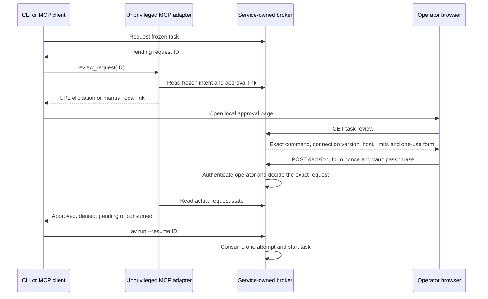

# Authenticated local approval

Status: implemented synthetic flow, 2026-10-06. This is URL elicitation plus a local operator page, not an MCP App or direct authorization from a harness response.

## Updated product direction

The next approval flow must use MCP Apps in the configured trusted harness. A client without Apps support must be refused for this flow, with no automatic browser fallback. Core MCP form elicitation is a separate capability and does not satisfy that requirement. Storage unlock and per-task approval are separate actions; an unlocked operator session should not require a password for every task. The local console now implements a 15-minute operator session. MCP Apps capability negotiation, App UI integration, and its broker-authorized decision channel still need implementation and validation. Hiding a decision tool from the model does not authenticate its caller.

The remainder of this guide describes the existing local-page implementation and its test evidence, not the planned Apps flow.

## Operator console

The root page at `http://127.0.0.1:14323/` is a React/Tailwind console for credentials, configured permissions, and task approvals. It defaults to dark mode with a temporary light-mode toggle. Effect validates API responses at runtime. The existing request-specific link remains available to the current MCP adapter; the console itself is not an MCP App.

Sign in with the vault passphrase to create an absolute 15-minute session. The browser receives an HttpOnly, SameSite=Strict cookie; the CSRF token stays in application memory. No credential, session token, or passphrase is written to browser storage. The broker retains a zeroizing passphrase copy in memory for authenticated operations. Expired sessions are rejected immediately and removed by a 15-second cleanup timer. Locking invalidates sessions under the broker's exclusive gate; it also stops tasks. Sign out removes the current browser session without stopping tasks.

Operator sign-in and enabling task execution are separate. Credentials can be added, rotated, disconnected, or granted the broker's configured recipe only while execution is paused. Permission editing does not create arbitrary command recipes. Granting without a matching operator-owned recipe is refused. Decisions authorize one attempt within 60 seconds and do not return execution capabilities to the page.

The service embeds the compiled HTML, CSS, and JavaScript. Its Content Security Policy allows same-origin assets and API calls, prohibits inline scripts and framing, and makes responses non-cacheable. A build without web assets returns an unavailable response for the console. Exact Host/Origin checks, bounded JSON bodies, one-use login nonces, throttled authentication, and CSRF checks protect the operator API. Loopback HTTP and an authenticated page do not establish exclusive execution ownership against another process sharing the agent UID.

## Flow



The page at `http://127.0.0.1:14323/requests/REQUEST_ID` belongs to `avd`. The operator sends the passphrase directly to that page. Neither MCP arguments nor elicitation responses contain it. The private terminal approval route remains available.

The broker publishes a link only after its local listener binds. The MCP adapter obtains that link from the broker and rejects a non-loopback destination, a different request ID, or an added query. Project files and tool arguments cannot choose the approval URL.

A client supporting MCP URL elicitation can offer to open the page. Other clients receive the link for manual review. Returning `accept`, `decline`, `cancel`, or an arbitrary `approve=true` object does not decide a request. After elicitation, the adapter reads the broker state rather than interpreting the client's answer as approval. No actual Codex or other named harness compatibility claim follows from the protocol tests.

The adapter exposes only `request_proxy_task` and `review_request`. Execution goes through `av run --resume`; MCP has no execution tool that could return a proxy capability to the model.

## Enable and use

The Linux systemd unit and macOS broker plist enable the listener with `AVD_APPROVAL_UI=1`. These files need installation or deployment before their settings take effect. A development daemon must set the same variable explicitly. An unset variable disables the page; unsupported values fail startup. The listener is fixed to IPv4 loopback and an occupied port fails startup instead of selecting another destination. It never binds a public interface.

1. Initialize and unlock the broker through the existing operator path.
2. Request the configured synthetic task with `av run -- COMMAND` or MCP `request_proxy_task`.
3. Call MCP `review_request`, or open the local link printed by `av`.
4. Review the exact command arguments, connection version, target host, runtime and quotas. Enter the vault passphrase on the local page and choose Approve or Deny.
5. Resume an approved request with `av run --resume REQUEST_ID`.

Approving allows one execution attempt within 60 seconds. The task's own runtime and quotas still come from the operator-owned recipe. A form expires after 120 seconds and is consumed once. Failed authentication requires reloading the form. Pending requests retain the broker's existing five-minute decision window. Locking or restarting the broker discards requests and grants; an old page cannot authorize a new session.

## MCP adapter configuration

Build the prototype adapter with `cargo build --locked -p av-mcp --bin av-mcp`. Configure the client's stdio MCP server command to point to the absolute `av-mcp` binary and pass `AVD_AGENT_SOCKET` as a non-secret environment setting:

| Platform | Installed agent socket |
| --- | --- |
| Linux | `/run/agents-vault/agent.sock` |
| macOS | `/private/var/db/agents-vault/agent/agent.sock` |

The adapter runs as the configured agent user. It needs no vault path, passphrase, admin token or privileged identity. For development tests, the socket can belong to a disposable broker. Client-specific configuration syntax and actual URL-elicitation UI must be verified with the selected client; this guide does not install a harness launcher.

## Controls and assumptions

- Both approval and denial require the vault passphrase. Knowing a request ID or obtaining a form nonce grants no decision authority.
- The HTTP handler checks exact Host and Origin, rejects cross-site submissions and query strings, requires a bounded form body, and rejects duplicate or unknown fields.
- Form nonces are random, bound to one request, expire, and are consumed before authentication. Parallel replay of one form cannot authorize twice.
- Broker-owned review fields are JSON escaped, including Unicode layout controls, then HTML escaped. Pages disallow scripts, framing, external resources and foreign form destinations. Responses use `no-store` and `no-referrer`.
- Connections, bodies and open forms are bounded. Authentication attempts are throttled. Passphrase authentication runs outside the asynchronous I/O worker and secret-bearing application buffers use zeroizing wrappers. This is best-effort memory handling; HTTP libraries and the browser may retain their own copies.
- The installed broker identity and vault permissions remain necessary. Running the daemon under the agent's login UID is a development test, not protected custody.
- The operator must trust the local browser, host and installed broker. Plain loopback HTTP is not remote administration, TLS identity verification, or protection from a compromised operator session. Do not tunnel or expose this listener as a remote approval interface.
- A same-UID process can still race execution of an approved request, copy its temporary proxy capability or end a host task. This change authenticates the decision; it does not solve that separate execution-ownership issue.

## Verification without a harness

`crates/avd/tests/approval_ui.rs` exercises the actual HTTP listener and broker sockets: escaped review, wrong origin and Host, unknown or duplicate fields, bad password, consumed and mismatched nonces, simultaneous submissions, lock and stale-session refusal.

`crates/av-mcp/src/main.rs` tests protocol behavior using a synthetic client: forged positive responses, malformed positive content, cancellation, client errors and timeouts, unsupported URL elicitation, authentic browser approval and denial, and rejection of remote or mismatched links. The simulated browser supplies only synthetic credentials directly to HTTP.

`crates/av-cli/tests/brokered_curl.rs` joins the public CLI, locked-start session, private operator authentication and local HTTPS proxy. It covers pending, denial, expiry, altered command, concurrent decisions and execution, replay, successful injection, relock and stale request rejection. Run it separately because it binds the fixed proxy port:

```sh
cargo test --locked -p av --test brokered_curl -- --ignored --nocapture
```

`packaging/linux/test_systemd_lifecycle.py` tests the local page in a disposable guest running real systemd, a service-owned vault and separate broker, agent and runner UIDs. It checks origin, authentication and form replay before resuming a versioned connection through public `av run`.

The Linux workspace suite, development broker/MCP tests on macOS, public CLI lifecycle tests on both systems, and the disposable installed Linux guest passed. Linux and macOS development tests do not prove installed macOS custody. The macOS installed-service gate, full agent-route review and same-UID execution ownership remain open. The Codex Security scan launcher did not return a confirmed scan identity during this task; these test results must not be described as a completed independent static security scan.

The operator console also has real HTTP lifecycle tests in `crates/avd/tests/operator_web.rs`, strict frontend checks, and browser workflow/accessibility checks in `web/tests/operator.spec.ts`. These tests use disposable encrypted vaults and synthetic credentials; they do not prove installed custody or actual MCP Apps compatibility.
