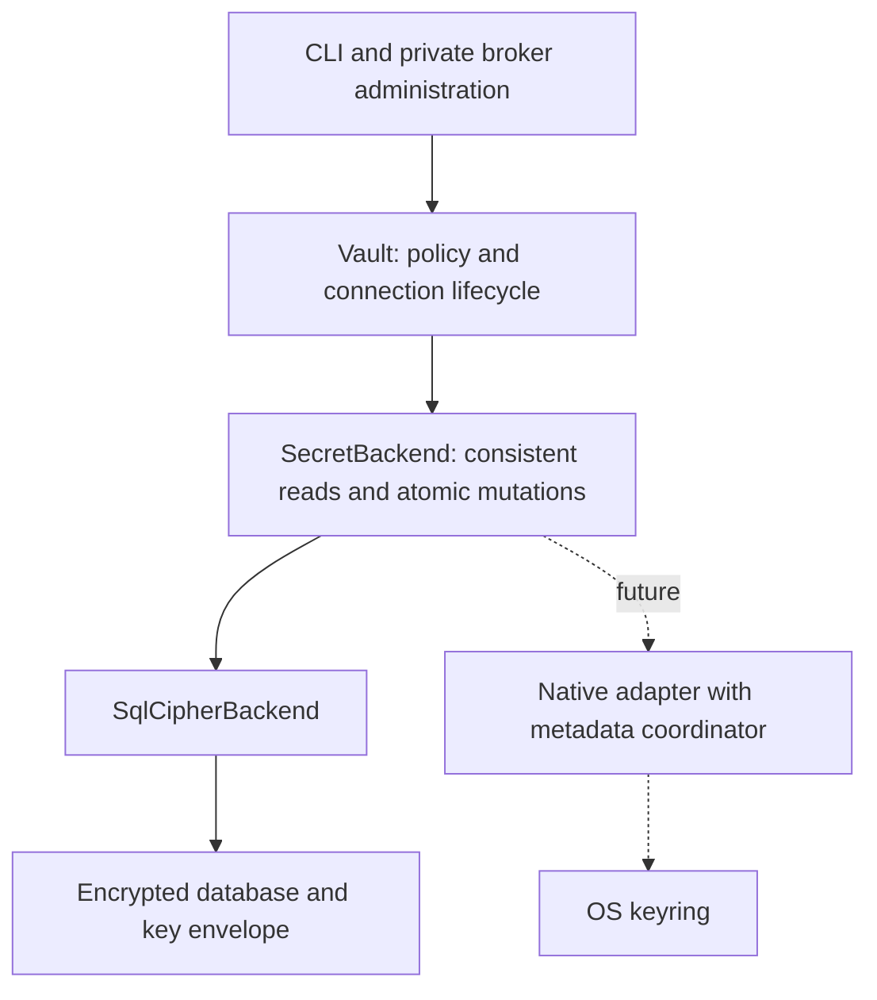

# Storage adapters

Status: SQLCipher adapter extracted on 2026-10-06. Native keyring integration follows the pending custody, approval, and installed-platform gates in the [work queue](work-queue.md). No native adapter or backend selection command is implemented yet.

## Current boundary

`Vault` owns validation, generic secret rules, connection versions, delivery policy, and approval checks. It has no SQL connection. `SecretBackend` is a trusted persistence session with three operations: read one entry, list keys, and atomically apply conditional mutations. `SqlCipherBackend` implements this contract; the existing CLI and broker still open it by default. All modules remain inside `av-core`.

An entry contains an opaque credential payload and serialized policy metadata. Connection payloads currently include their connection metadata and credential. `Vault` interprets and validates those records; adapters cannot grant access or interpret an MCP form answer as approval. Adapter reads occur only in trusted code. The Rust trait is a persistence boundary, not an agent-accessible credential API.

SQLCipher file creation, passphrase unlock, recovery, backup, restore, and database-key rotation remain specific to `SqlCipherBackend`. The encrypted database schema and envelope format have not changed. There is no simulated native backend, silent fallback, or project-controlled backend selection. The memory adapter exists only in integration tests to check that domain policy does not depend on SQL.

## Required adapter guarantees

- A read returns the credential payload and policy from one consistent snapshot.
- A mutation compares the complete expected entry, including policy. A concurrent rotation or revocation must make an outdated write fail rather than restore old grants.
- A batch publishes every mutation atomically across all callers, including separate processes. Failed comparisons, failed writes, and duplicate keys publish nothing.
- Connection replacement publishes the new version and removes the old grants in the same mutation. Disconnect preserves a versioned tombstone without its credential.
- Returned credential buffers are zeroized on drop. Entry debug output redacts values and policy. Adapters must not log credentials or authentication material.
- Missing data, an unavailable service, a locked keyring, a denied prompt, and a storage failure must not select another credential source or weaken delivery policy.

The contract tests cover SQLCipher and a test-only memory implementation. They exercise batch conflicts, duplicate keys, deletion, stale-policy refusal, competing SQLCipher sessions, default deny, approval, connection rotation, revocation, and disconnect. A SQLCipher write-failure test also checks rollback after an earlier write in the batch. Existing encrypted backup and process-interruption tests remain in place.

## Native integration after the pending gates

Native keyrings expose credential operations, but do not provide the same transaction contract as our encrypted database. Implementing `SecretBackend` by directly mapping its operations to keyring get/set calls would not satisfy this contract. The native integration needs an operator-owned metadata coordinator and a publication protocol for credential generations.

Before implementing a native adapter:

1. Verify its actual deployment context on macOS and Linux: login session versus service identity, GUI prompts versus unattended broker access, keyring availability, and which other applications can retrieve or change its items. A storage adapter does not resolve the shared-UID task-capability issue.
2. Separate metadata inspection from credential retrieval so listing, reviewing, and denying a request do not retrieve a secret or trigger a credential-access prompt. The current combined connection payload must be revised for this integration.
3. Define how an immutable credential generation is written, checked, and made active through operator-owned metadata. Establish cross-process serialization and restart recovery before enabling writes. Test rotation, revocation, disconnect, orphan cleanup, and failure between external storage and metadata publication.
4. Keep backend identity and selection in operator-controlled vault configuration. A project contains references and cannot redirect the broker to another keyring, account, vault, or adapter. Missing platform support must produce a clear error.
5. Define capabilities per adapter for interactive access, unattended access, item creation/deletion, recovery, export, and backup. SQLCipher backup commands must not be presented as portable recovery for native keyring items.
6. Run the same storage and domain contract checks, plus installed tests with genuine native stores and adversarial same-user clients. Enable protected use only for deployment contexts whose custody boundary has passed.

Apple Keychain and Linux Secret Service are the first native candidates. Linux Secret Service normally runs in the user's login session, and its specification does not mandate application access controls. Those characteristics need deployment-specific validation: [session model](https://specifications.freedesktop.org/secret-service/latest/ch01.html), [access controls](https://specifications.freedesktop.org/secret-service/latest/ch10.html). Apple exposes different macOS keychain implementations and access models: [Apple keychain guidance](https://developer.apple.com/documentation/technotes/tn3137-on-mac-keychains).

## Native storage versus native unlock

Storing each credential in a keyring and storing the SQLCipher database key in a keyring are separate integrations. The first changes credential persistence and needs the metadata coordinator. The second keeps SQLCipher and adds a platform-specific unlock mechanism. Define an unlock-provider interface when that integration is implemented; no unused unlock abstraction is introduced now.

Unlocking storage does not approve a task. The operator approval mechanism must retain its own authentication and exact-request checks if native unlock removes the vault-passphrase prompt. Recovery and unattended access must be specified independently rather than inherited from the keyring's user experience.

Multiple logical vaults and external password managers can use these boundaries later. Their identifier, authority, and recovery semantics must be defined before adding adapters. The Rust interface may evolve before the first release; compatibility shims for unshipped adapter contracts are unnecessary.
